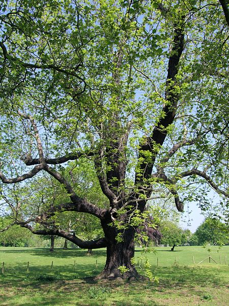
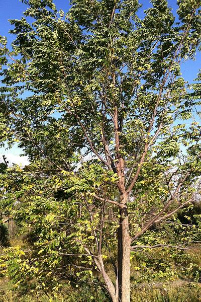
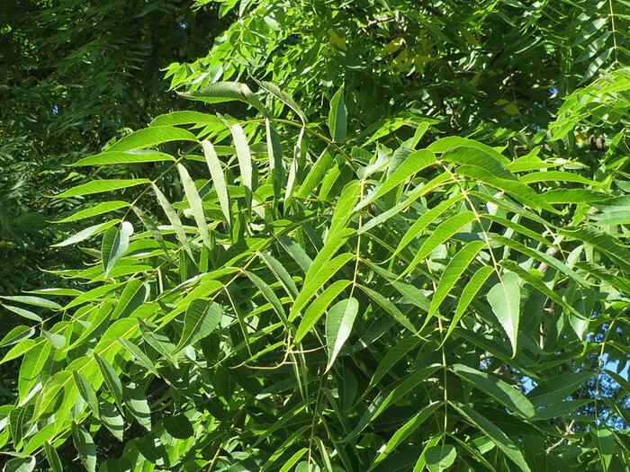
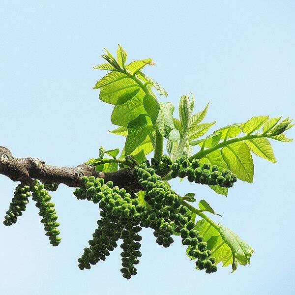

# Anki 🌲🌴 **TREE** 🎄🌳 Identification

This is an in-progress deck of flashcards for [Anki](https://apps.ankiweb.net/), to learn to identify 🌲🌴 **TREES** 🎄🌳

The card formats _(Front &#8594; Back)_ are:
 1. Full image &#8594; Common name (and scientific name)
 1. Leaf image &#8594; Common name (and scientific name)
 1. Flower image &#8594; Common name (and scientific name)
 1. Fruit/seed image &#8594; Common name (and scientific name)
 1. Scientific name &#8594; Common name
 1. Common name &#8594; Scientific name

Most notes have all of the above types, but a few are missing appropriate photos for flower, fruit, or seed.

If you don't care about some of these categories, no worries! Tweaking or disabling any of the card types in Anki is trivial. This deck aims to encompass most 🌲🌴 **TREE** 🎄🌳 enthusiasts' learning desires.

You can see the full list [here](all-notes.md).

## Example: Black Walnut

For example, here's all the information on the _Juglans nigra_ note:

<table>
<tr><td><code>common_name</code></td><td>Black walnut</td></tr>
<tr><td><code>scientific_name</code></td><td>Juglans nigra</td></tr>
<tr><td><code>native_region</code></td><td>Eastern N. America</td></tr>
<tr><td><code>full_photo</code></td><td></td></tr>
<tr><td><code>full_photo_attribution</code></td><td><a href="https://commons.wikimedia.org/wiki/File:The_Mable_Hill_Park_Black_Walnut_Tree_-_London._(4621671958).jpg">Jim Linwood from London</a>, <a href="https://creativecommons.org/licenses/by/2.0">CC BY 2.0</a>, via Wikimedia Commons;&nbsp;<a href="https://commons.wikimedia.org/wiki/File:Juglans_nigra_SCA-0322.jpg">R. A. Nonenmacher</a>, <a href="https://creativecommons.org/licenses/by-sa/4.0">CC BY-SA 4.0</a>, via Wikimedia Commons</td></tr>
<tr><td><code>leaf_photo</code></td><td></td></tr>
<tr><td><code>leaf_photo_attribution</code></td><td><a href="https://commons.wikimedia.org/wiki/File:20130903Juglans_nigra8.jpg">AnRo0002</a>, CC0, via Wikimedia Commons</td></tr>
<tr><td><code>flower_photo</code></td><td></td></tr>
<tr><td><code>flower_photo_attribution</code></td><td><a href="https://commons.wikimedia.org/wiki/File:Male_catkins_Juglans_nigra1.jpg">Gmihail at Serbian Wikipedia</a>, <a href="https://creativecommons.org/licenses/by-sa/3.0/rs/deed.en">CC BY-SA 3.0 RS</a>, via Wikimedia Commons</td></tr>
<tr><td><code>fruit_or_seed_photo</code></td><td></td></tr>
<tr><td><code>fruit_or_seed_photo_attribution</code></td><td>Public domain, via&nbsp;<a href="https://commons.wikimedia.org/wiki/File:Black_Walnut_nut_and_leave_detail.JPG">Wikimedia Commons</a></td></tr></table>

## How to use

 1. Install the free and open-source flashcard software [Anki](https://apps.ankiweb.net/).
 1. `Tools` &#8594; `Addons` &#8594; `Get Add-ons`
 1. Paste in the code for the [CrowdAnki](https://ankiweb.net/shared/info/1788670778) add-on (At time of writing, it's `1788670778`, but be careful to only install add-ons you trust!)
 1. Close and reopen Anki
 1. Unfortunately, I can't get `File` &#8594; `CrowdAnki: Import from Github`, to work, so instead:
 1. Download this repository, either as a zip (unzip it) or using git.
 1. `File` &#8594; `CrowdAnki: Import from Disk`, and navigate to select the download location.

## Contributing

Making high quality identification flash cards is hard, but interesting! This assumes you are already familiar with how Github works, and how Anki works. Here's how to contribute:

 1. Fork this repo on Github, and clone it to your machine
 1. `File` &#8594; `CrowdAnki: Import from Disk`, and navigate to select the download location.
 1. Add a new 🌲🌴 **TREE** 🎄🌳 if you don't see its scientific name already in the deck

  > ### 📷 _**Photo selection**_
  > - Lets keep photos legal and attributed. [Wikimedia](https://commons.wikimedia.org/wiki/Main_Page) is a fantastic place to search for images, and the attribution is straightforward:
  >   - `Use this file on the web` &#8594; `Attribution` &#8594; Check `HTML` &#8594; Copy &#8594; Open the HTML editor in Anki's attribution field (Ctrl+Shift+X) &#8594; Paste.
  > - Photos should represent the typical 🌲🌴 **TREE** 🎄🌳, the typical leaves, the typical flower, etc. Better to omit a photo category rather than add an unidentifiable or atypical example.
  > - Whole photos: Try to capture the size and branching pattern of the entire 🌲🌴 **TREE** 🎄🌳.
  > - Leaf/flower/seed/fruit photos: Try to capture the size and details of individual leaf/flower/fruit/seed, and the twig or branch structure supporting them.
  > - Avoid photos of stuff not attached to the 🌲🌴 **TREE** 🎄🌳 anymore
  > - Avoid photos with distracting details
  > - Contributing your own photos? Go the extra mile and [upload them to Wikimedia first](https://commons.wikimedia.org/wiki/Commons:Contributing_your_own_work) so they can be easily used and attributed by others!

 4. Export the deck, using the CrowdAnki plugin, overwriting your downloaded git repository.
 1. Check that the changes make sense (`git status` and `git diff`). You should see your new photos and some additions to `deck.json` for every new note you added.
 1. (Optional, Unix) run `./optimize-images.sh` (You need to have Image Magick installed). This will take your new, full-size images and compress them down a little bit, while saving a backup to the `original-size-media` directory. Then you should reimport (see step #2 above) so Anki uses/exports these compressed images instead of the full-quality ones.
 1. (Optional, Unix) run `./get-notes-markdown.py` (You need to have python3 installed). This will update all-notes.md with your additions.
 1. `git commit` the changes with a good descriptive commit message, and `git push`. Create a pull request from your fork back to the original repository!

# 🍁
