<h1>All 🌲🌴 **TREES** 🎄🌳 in this deck</h1>
<em>(28 notes)</em>
<h2>Eastern Redbud</h2><table>
<tr><td><code>common_name</code></td><td>Eastern Redbud</td></tr>
<tr><td><code>scientific_name</code></td><td>Cercis canadensis</td></tr>
<tr><td><code>native_region</code></td><td>Eastern N. America</td></tr>
<tr><td><code>full_photo</code></td><td>

</td></tr>
<tr><td><code>full_photo_attribution</code></td><td><a href="https://commons.wikimedia.org/wiki/File:Redbud_tree_(Cercis_canadensis)_Broad_View.jpg">Lambique</a>, <a href="https://creativecommons.org/licenses/by-sa/3.0">CC BY-SA 3.0</a>, via Wikimedia Commons</td></tr>
<tr><td><code>leaf_photo</code></td><td>

</td></tr>
<tr><td><code>leaf_photo_attribution</code></td><td><a href="https://commons.wikimedia.org/wiki/File:Redbud_tree_(Cercis_canadensis)_Close_Up_View.jpg">Lambique</a>, <a href="https://creativecommons.org/licenses/by-sa/3.0">CC BY-SA 3.0</a>, via Wikimedia Commons</td></tr>
<tr><td><code>flower_photo</code></td><td> </td></tr>
<tr><td><code>flower_photo_attribution</code></td><td><a href="https://commons.wikimedia.org/wiki/File:RedbudsOhio.jpg">Greg Hume</a>, <a href="https://creativecommons.org/licenses/by-sa/3.0">CC BY-SA 3.0</a>, via Wikimedia Commons</td></tr>
<tr><td><code>fruit_or_seed_photo</code></td><td></td></tr>
<tr><td><code>fruit_or_seed_photo_attribution</code></td><td><a href="https://commons.wikimedia.org/wiki/File:Cercis_canadensis_16zz.jpg">Photo by David J. Stang</a>, <a href="https://creativecommons.org/licenses/by-sa/4.0">CC BY-SA 4.0</a>, via Wikimedia Commons</td></tr></table>

<h2>Black walnut</h2><table>
<tr><td><code>common_name</code></td><td>Black walnut</td></tr>
<tr><td><code>scientific_name</code></td><td>Juglans nigra</td></tr>
<tr><td><code>native_region</code></td><td>Eastern N. America</td></tr>
<tr><td><code>full_photo</code></td><td>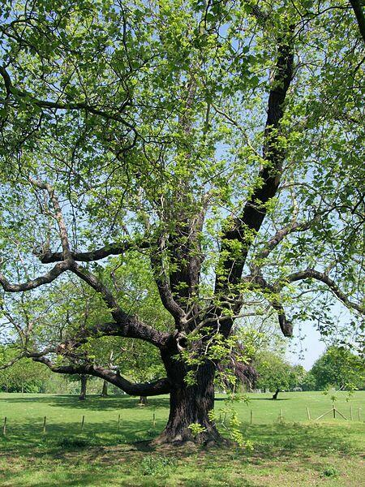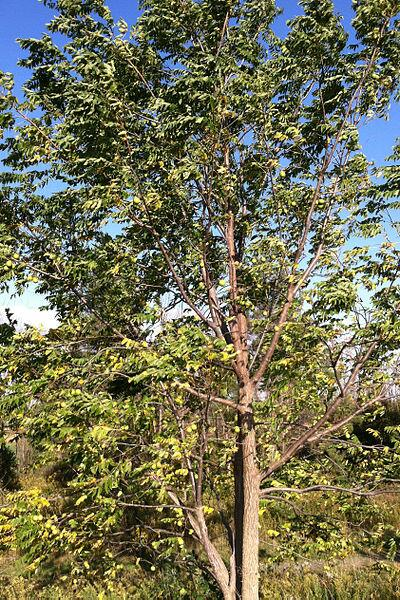</td></tr>
<tr><td><code>full_photo_attribution</code></td><td><a href="https://commons.wikimedia.org/wiki/File:The_Mable_Hill_Park_Black_Walnut_Tree_-_London._(4621671958).jpg">Jim Linwood from London</a>, <a href="https://creativecommons.org/licenses/by/2.0">CC BY 2.0</a>, via Wikimedia Commons;&nbsp;<a href="https://commons.wikimedia.org/wiki/File:Juglans_nigra_SCA-0322.jpg">R. A. Nonenmacher</a>, <a href="https://creativecommons.org/licenses/by-sa/4.0">CC BY-SA 4.0</a>, via Wikimedia Commons</td></tr>
<tr><td><code>leaf_photo</code></td><td></td></tr>
<tr><td><code>leaf_photo_attribution</code></td><td><a href="https://commons.wikimedia.org/wiki/File:20130903Juglans_nigra8.jpg">AnRo0002</a>, CC0, via Wikimedia Commons</td></tr>
<tr><td><code>flower_photo</code></td><td></td></tr>
<tr><td><code>flower_photo_attribution</code></td><td><a href="https://commons.wikimedia.org/wiki/File:Male_catkins_Juglans_nigra1.jpg">Gmihail at Serbian Wikipedia</a>, <a href="https://creativecommons.org/licenses/by-sa/3.0/rs/deed.en">CC BY-SA 3.0 RS</a>, via Wikimedia Commons</td></tr>
<tr><td><code>fruit_or_seed_photo</code></td><td>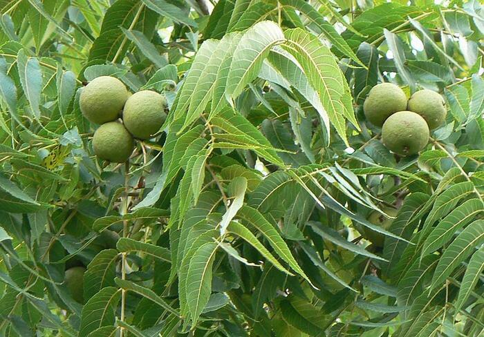</td></tr>
<tr><td><code>fruit_or_seed_photo_attribution</code></td><td>Public domain, via&nbsp;<a href="https://commons.wikimedia.org/wiki/File:Black_Walnut_nut_and_leave_detail.JPG">Wikimedia Commons</a></td></tr></table>

<h2>Eastern Cottonwood</h2><table>
<tr><td><code>common_name</code></td><td>Eastern Cottonwood</td></tr>
<tr><td><code>scientific_name</code></td><td>Populus deltoides</td></tr>
<tr><td><code>native_region</code></td><td>Eastern N. America</td></tr>
<tr><td><code>full_photo</code></td><td></td></tr>
<tr><td><code>full_photo_attribution</code></td><td><a href="https://commons.wikimedia.org/wiki/File:Eastern_Cottonwood_(Populus_deltoides)_-_Flickr_-_Jay_Sturner_(2).jpg">Jay Sturner from USA</a>, <a href="https://creativecommons.org/licenses/by/2.0">CC BY 2.0</a>, via Wikimedia Commons</td></tr>
<tr><td><code>leaf_photo</code></td><td></td></tr>
<tr><td><code>leaf_photo_attribution</code></td><td><a href="https://commons.wikimedia.org/wiki/File:Peuplier_deltoïde_feuillage.jpg">Laurent Bélanger</a>, <a href="https://creativecommons.org/licenses/by-sa/4.0">CC BY-SA 4.0</a>, via Wikimedia Commons</td></tr>
<tr><td><code>flower_photo</code></td><td></td></tr>
<tr><td><code>flower_photo_attribution</code></td><td><a href="https://commons.wikimedia.org/wiki/File:Seeds_and_Fluff_of_Cottonwood.jpg">Amiyashrivastava</a>, <a href="https://creativecommons.org/licenses/by-sa/3.0">CC BY-SA 3.0</a>, via Wikimedia Commons</td></tr>
<tr><td><code>fruit_or_seed_photo</code></td><td></td></tr>
<tr><td><code>fruit_or_seed_photo_attribution</code></td><td><a href="https://commons.wikimedia.org/wiki/File:Populus_deltoides_(Eastern_Cottonwood)_(42164128654).jpg">Plant Image Library from Boston, USA</a>, <a href="https://creativecommons.org/licenses/by-sa/2.0">CC BY-SA 2.0</a>, via Wikimedia Commons</td></tr></table>

<h2>American Beech</h2><table>
<tr><td><code>common_name</code></td><td>American Beech</td></tr>
<tr><td><code>scientific_name</code></td><td>Fagus grandifolia</td></tr>
<tr><td><code>native_region</code></td><td>Eastern N. America</td></tr>
<tr><td><code>full_photo</code></td><td>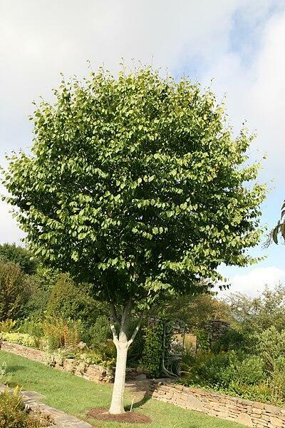</td></tr>
<tr><td><code>full_photo_attribution</code></td><td><a href="https://commons.wikimedia.org/wiki/File:Fagus_grandifolia_JPG1Ms.jpg">Jean-Pol GRANDMONT</a>, <a href="https://creativecommons.org/licenses/by/3.0">CC BY 3.0</a>, via Wikimedia Commons;&nbsp;<a href="https://commons.wikimedia.org/wiki/File:Fagus_grandifolia_12zz.jpg">Photo by David J. Stang</a>, <a href="https://creativecommons.org/licenses/by-sa/4.0">CC BY-SA 4.0</a>, via Wikimedia Commons</td></tr>
<tr><td><code>leaf_photo</code></td><td></td></tr>
<tr><td><code>leaf_photo_attribution</code></td><td><a href="https://commons.wikimedia.org/wiki/File:Fagus_grandifolia_36zz.jpg">Photo by David J. Stang</a>, <a href="https://creativecommons.org/licenses/by-sa/4.0">CC BY-SA 4.0</a>, via Wikimedia Commons</td></tr>
<tr><td><code>flower_photo</code></td><td>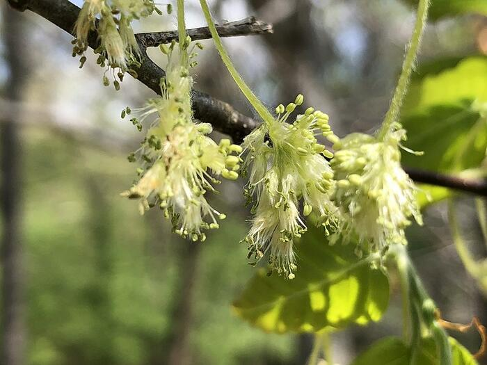</td></tr>
<tr><td><code>flower_photo_attribution</code></td><td><a href="https://commons.wikimedia.org/wiki/File:2021-04-17_11_34_07_American_Beech_flowers_along_a_walking_path_in_the_Franklin_Glen_section_of_Chantilly,_Fairfax_County,_Virginia.jpg">Famartin</a>, <a href="https://creativecommons.org/licenses/by-sa/4.0">CC BY-SA 4.0</a>, via Wikimedia Commons</td></tr>
<tr><td><code>fruit_or_seed_photo</code></td><td></td></tr>
<tr><td><code>fruit_or_seed_photo_attribution</code></td><td><a href="https://commons.wikimedia.org/wiki/File:Fagus_grandifolia_(American_Beech)_(37034236702).jpg">Plant Image Library from Boston, USA</a>,&nbsp;<a href="https://creativecommons.org/licenses/by-sa/2.0">CC BY-SA 2.0</a>, via Wikimedia Commons</td></tr></table>

<h2>Red Mulberry</h2><table>
<tr><td><code>common_name</code></td><td>Red Mulberry</td></tr>
<tr><td><code>scientific_name</code></td><td>Morus rubra</td></tr>
<tr><td><code>native_region</code></td><td>Eastern N. America</td></tr>
<tr><td><code>full_photo</code></td><td></td></tr>
<tr><td><code>full_photo_attribution</code></td><td><a href="https://commons.wikimedia.org/wiki/File:2020-11-14_10_25_04_A_Red_Mulberry_turning_yellow_in_autumn_along_Hidden_Meadow_Drive_in_the_Franklin_Farm_section_of_Oak_Hill,_Fairfax_County,_Virginia.jpg">Famartin</a>, <a href="https://creativecommons.org/licenses/by-sa/4.0">CC BY-SA 4.0</a>, via Wikimedia Commons</td></tr>
<tr><td><code>leaf_photo</code></td><td>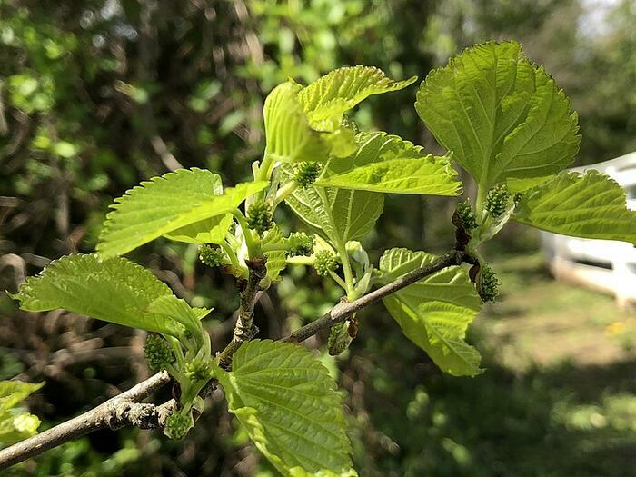</td></tr>
<tr><td><code>leaf_photo_attribution</code></td><td><a href="https://commons.wikimedia.org/wiki/File:2020-04-10_14_11_15_New_leaves_and_flower_buds_in_spring_on_a_Red_Mulberry_along_Old_Dairy_Road_in_the_Franklin_Farm_section_of_Oak_Hill,_Fairfax_County,_Virginia.jpg">Famartin</a>, <a href="https://creativecommons.org/licenses/by-sa/4.0">CC BY-SA 4.0</a>, via Wikimedia Commons</td></tr>
<tr><td><code>flower_photo</code></td><td></td></tr>
<tr><td><code>flower_photo_attribution</code></td><td><a href="https://commons.wikimedia.org/wiki/File:2020-04-21_17_07_46_Red_Mulberry_leaves_and_flowers_within_Franklin_Farm_Park_in_the_Franklin_Farm_section_of_Oak_Hill,_Fairfax_County,_Virginia.jpg">Famartin</a>, <a href="https://creativecommons.org/licenses/by-sa/4.0">CC BY-SA 4.0</a>, via Wikimedia Commons</td></tr>
<tr><td><code>fruit_or_seed_photo</code></td><td></td></tr>
<tr><td><code>fruit_or_seed_photo_attribution</code></td><td><a href="https://commons.wikimedia.org/wiki/File:Morus_sp._02.jpg">Zeynel Cebeci</a>,&nbsp;<a href="https://creativecommons.org/licenses/by-sa/4.0">CC BY-SA 4.0</a>, via Wikimedia Commons</td></tr></table>

<h2>Sugar Maple</h2><table>
<tr><td><code>common_name</code></td><td>Sugar Maple</td></tr>
<tr><td><code>scientific_name</code></td><td>Acer saccharum</td></tr>
<tr><td><code>native_region</code></td><td>Eastern N. America</td></tr>
<tr><td><code>full_photo</code></td><td>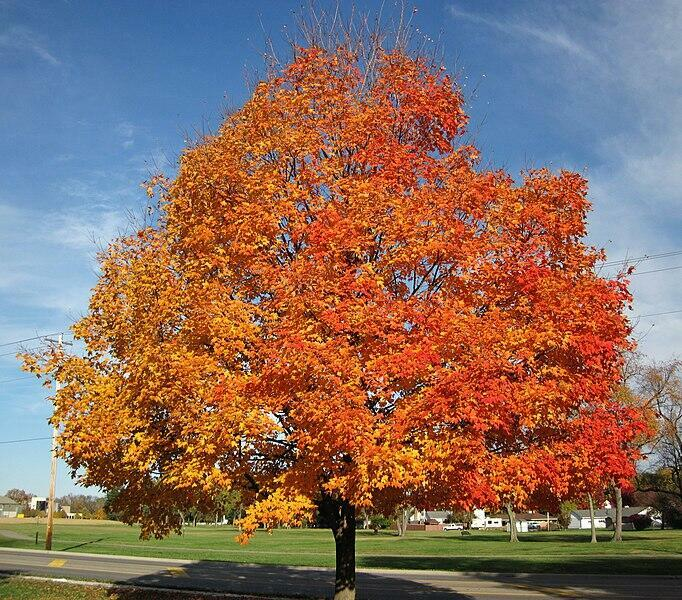</td></tr>
<tr><td><code>full_photo_attribution</code></td><td><a href="https://commons.wikimedia.org/wiki/File:Acer_saccharum_(sugar_maple_tree_in_fall_colors)_(Country_Club_Drive,_Newark,_Ohio,_USA)_(25_October_2015)_7_(21860848273).jpg">James St. John</a>, <a href="https://creativecommons.org/licenses/by/2.0">CC BY 2.0</a>, via Wikimedia Commons</td></tr>
<tr><td><code>leaf_photo</code></td><td></td></tr>
<tr><td><code>leaf_photo_attribution</code></td><td><a href="https://commons.wikimedia.org/wiki/File:Acer_saccharum_1-jgreenlee_(5098070608).jpg">Superior National Forest</a>, <a href="https://creativecommons.org/licenses/by/2.0">CC BY 2.0</a>, via Wikimedia Commons</td></tr>
<tr><td><code>flower_photo</code></td><td>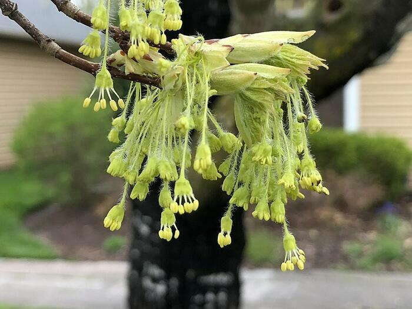</td></tr>
<tr><td><code>flower_photo_attribution</code></td><td><a href="https://commons.wikimedia.org/wiki/File:2020-03-28_18_23_36_Sugar_Maple_flowers_along_Brightfield_Lane_in_the_Franklin_Farm_section_of_Oak_Hill,_Fairfax_County,_Virginia.jpg">Famartin</a>, <a href="https://creativecommons.org/licenses/by-sa/4.0">CC BY-SA 4.0</a>, via Wikimedia Commons</td></tr>
<tr><td><code>fruit_or_seed_photo</code></td><td>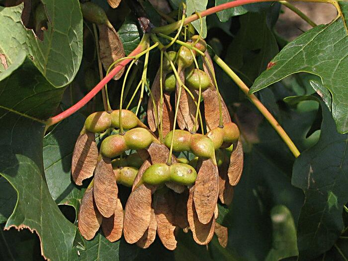</td></tr>
<tr><td><code>fruit_or_seed_photo_attribution</code></td><td><a href="https://commons.wikimedia.org/wiki/File:Sugar_maple_3220.jpg">Quercus1981</a>, <a href="https://creativecommons.org/licenses/by-sa/3.0">CC BY-SA 3.0</a>, via Wikimedia Commons</td></tr></table>

<h2>Boxelder Maple</h2><table>
<tr><td><code>common_name</code></td><td>Boxelder Maple</td></tr>
<tr><td><code>scientific_name</code></td><td>Acer negundo</td></tr>
<tr><td><code>native_region</code></td><td>Eastern N. America</td></tr>
<tr><td><code>full_photo</code></td><td></td></tr>
<tr><td><code>full_photo_attribution</code></td><td><a href="https://commons.wikimedia.org/wiki/File:Eschen-Ahorn_(Acer_negundo)_-9146.jpg">Hedwig Storch</a>, <a href="https://creativecommons.org/licenses/by-sa/3.0">CC BY-SA 3.0</a>, via Wikimedia Commons</td></tr>
<tr><td><code>leaf_photo</code></td><td></td></tr>
<tr><td><code>leaf_photo_attribution</code></td><td><a href="https://commons.wikimedia.org/wiki/File:Acer-negundo.jpg">Chrumps</a>, <a href="https://creativecommons.org/licenses/by/3.0">CC BY 3.0</a>, via Wikimedia Commons</td></tr>
<tr><td><code>flower_photo</code></td><td></td></tr>
<tr><td><code>flower_photo_attribution</code></td><td><a href="https://commons.wikimedia.org/wiki/File:Acer_negundo_2016-04-10_7201.jpg">Salicyna</a>, <a href="https://creativecommons.org/licenses/by-sa/4.0">CC BY-SA 4.0</a>, via Wikimedia Commons</td></tr>
<tr><td><code>fruit_or_seed_photo</code></td><td></td></tr>
<tr><td><code>fruit_or_seed_photo_attribution</code></td><td><a href="https://commons.wikimedia.org/wiki/File:CloseUpManitobaMapleSeed.jpg">SriMesh</a>, <a href="https://creativecommons.org/licenses/by-sa/3.0">CC BY-SA 3.0</a>, via Wikimedia Commons</td></tr></table>

<h2>Eastern Red Cedar/Juniper</h2><table>
<tr><td><code>common_name</code></td><td>Eastern Red Cedar/Juniper</td></tr>
<tr><td><code>scientific_name</code></td><td>Juniperus virginiana</td></tr>
<tr><td><code>native_region</code></td><td>Eastern N. America</td></tr>
<tr><td><code>full_photo</code></td><td>

</td></tr>
<tr><td><code>full_photo_attribution</code></td><td><a href="https://commons.wikimedia.org/wiki/File:2014-05-13_08_32_55_Eastern_Red_Cedar_at_South_Riding_Golf_Club_in_South_Riding,_Virginia.JPG">Famartin</a>, <a href="https://creativecommons.org/licenses/by-sa/3.0">CC BY-SA 3.0</a>, via Wikimedia Commons;&nbsp;<a href="https://commons.wikimedia.org/wiki/File:Juniperus_virginiana_tree.jpg">USDA-NRCS PLANTS Database / Herman, D.E. et al.</a>, Public domain, via Wikimedia Commons</td></tr>
<tr><td><code>leaf_photo</code></td><td>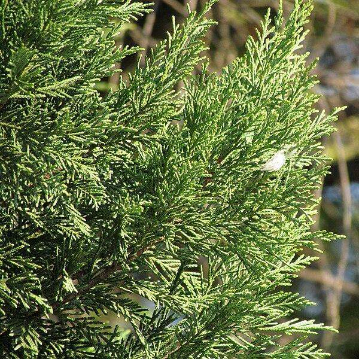</td></tr>
<tr><td><code>leaf_photo_attribution</code></td><td><a href="https://commons.wikimedia.org/wiki/File:Juniperus_virginiana_twig,_Belgrade.jpg">Gmihail at Serbian Wikipedia</a>, <a href="https://creativecommons.org/licenses/by-sa/3.0/rs/deed.en">CC BY-SA 3.0 RS</a>, via Wikimedia Commons</td></tr>
<tr><td><code>flower_photo</code></td><td></td></tr>
<tr><td><code>flower_photo_attribution</code></td><td></td></tr>
<tr><td><code>fruit_or_seed_photo</code></td><td></td></tr>
<tr><td><code>fruit_or_seed_photo_attribution</code></td><td><a href="https://commons.wikimedia.org/wiki/File:Juniper_berries_q.jpg">Quadell</a>,&nbsp;<a href="http://creativecommons.org/licenses/by-sa/3.0/">CC BY-SA 3.0</a>, via Wikimedia Commons</td></tr></table>

<h2>Bigleaf Maple/Oregon Maple</h2><table>
<tr><td><code>common_name</code></td><td>Bigleaf Maple/Oregon Maple</td></tr>
<tr><td><code>scientific_name</code></td><td>Acer macrophyllum</td></tr>
<tr><td><code>native_region</code></td><td>Western N. America</td></tr>
<tr><td><code>full_photo</code></td><td></td></tr>
<tr><td><code>full_photo_attribution</code></td><td><a href="https://commons.wikimedia.org/wiki/File:Acer_macrophyllum_1.jpg">Thayne Tuason</a>, <a href="https://creativecommons.org/licenses/by-sa/4.0">CC BY-SA 4.0</a>, via Wikimedia Commons;&nbsp;<a href="https://commons.wikimedia.org/wiki/File:Tall_bigleaf_maple.JPG">Jsayre64</a>, <a href="https://creativecommons.org/licenses/by-sa/3.0">CC BY-SA 3.0</a>, via Wikimedia Commons</td></tr>
<tr><td><code>leaf_photo</code></td><td>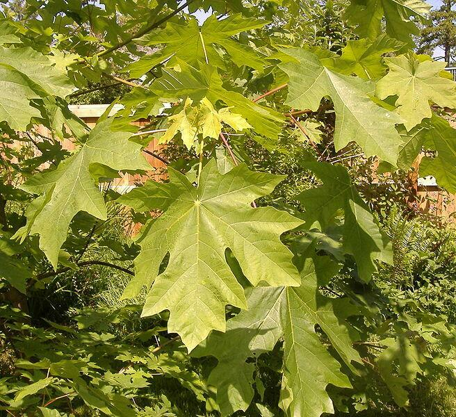</td></tr>
<tr><td><code>leaf_photo_attribution</code></td><td><a href="https://commons.wikimedia.org/wiki/File:Acer_macrophyllum_1199.jpg">Angilbas at English Wikipedia</a>, Public domain, via Wikimedia Commons</td></tr>
<tr><td><code>flower_photo</code></td><td>

</td></tr>
<tr><td><code>flower_photo_attribution</code></td><td><a href="https://commons.wikimedia.org/wiki/File:Acer_macrophyllum_2.jpg">Thayne Tuason</a>, <a href="https://creativecommons.org/licenses/by-sa/4.0">CC BY-SA 4.0</a>, via Wikimedia Commons</td></tr>
<tr><td><code>fruit_or_seed_photo</code></td><td></td></tr>
<tr><td><code>fruit_or_seed_photo_attribution</code></td><td><a href="https://commons.wikimedia.org/wiki/File:Acer_macrophyllum_3158.jpg">Walter Siegmund</a>, <a href="http://creativecommons.org/licenses/by-sa/3.0/">CC BY-SA 3.0</a>, via Wikimedia Commons</td></tr></table>

<h2>Red Maple</h2><table>
<tr><td><code>common_name</code></td><td>Red Maple</td></tr>
<tr><td><code>scientific_name</code></td><td>Acer rubrum</td></tr>
<tr><td><code>native_region</code></td><td>Eastern N. America</td></tr>
<tr><td><code>full_photo</code></td><td></td></tr>
<tr><td><code>full_photo_attribution</code></td><td><a href="https://commons.wikimedia.org/wiki/File:2014-10-30_11_09_40_Red_Maple_during_autumn_on_Lower_Ferry_Road_in_Ewing,_New_Jersey.JPG">Famartin</a>, <a href="https://creativecommons.org/licenses/by-sa/4.0">CC BY-SA 4.0</a>, via Wikimedia Commons;&nbsp;<a href="https://commons.wikimedia.org/wiki/File:Acer_rubrum_October_Glory_5zz.jpg">Photo by David J. Stang</a>, <a href="https://creativecommons.org/licenses/by-sa/4.0">CC BY-SA 4.0</a>, via Wikimedia Commons</td></tr>
<tr><td><code>leaf_photo</code></td><td></td></tr>
<tr><td><code>leaf_photo_attribution</code></td><td><a href="https://commons.wikimedia.org/wiki/File:Acer_rubrum_22zz.jpg">Photo by David J. Stang</a>, <a href="https://creativecommons.org/licenses/by-sa/4.0">CC BY-SA 4.0</a>, via Wikimedia Commons</td></tr>
<tr><td><code>flower_photo</code></td><td></td></tr>
<tr><td><code>flower_photo_attribution</code></td><td><a href="https://commons.wikimedia.org/wiki/File:Acer_rubrum_kz3.JPG">Krzysztof Ziarnek, Kenraiz</a>, <a href="https://creativecommons.org/licenses/by-sa/4.0">CC BY-SA 4.0</a>, via Wikimedia Commons</td></tr>
<tr><td><code>fruit_or_seed_photo</code></td><td></td></tr>
<tr><td><code>fruit_or_seed_photo_attribution</code></td><td><a href="https://commons.wikimedia.org/wiki/File:Acer_rubrum_seed_keys.jpg">Dcrjsr</a>, <a href="https://creativecommons.org/licenses/by/3.0">CC BY 3.0</a>, via Wikimedia Commons</td></tr></table>

<h2>Silver Maple</h2><table>
<tr><td><code>common_name</code></td><td>Silver Maple</td></tr>
<tr><td><code>scientific_name</code></td><td>Acer saccharinum</td></tr>
<tr><td><code>native_region</code></td><td>Eastern N. America</td></tr>
<tr><td><code>full_photo</code></td><td>
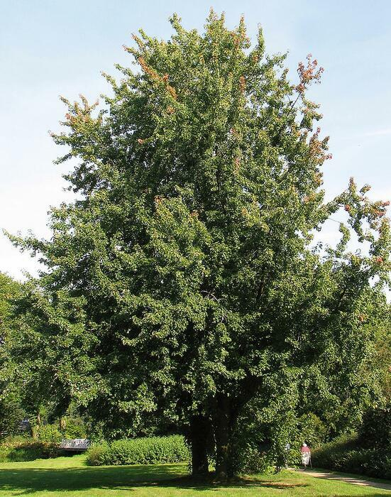
</td></tr>
<tr><td><code>full_photo_attribution</code></td><td><a href="https://commons.wikimedia.org/wiki/File:Silber-Ahorn_(Acer_saccharinum).jpg">Darkone (talk · contribs)</a>, <a href="https://creativecommons.org/licenses/by-sa/2.5">CC BY-SA 2.5</a>, via Wikimedia Commons;&nbsp;<a href="https://commons.wikimedia.org/wiki/File:Witte_esdoorn_(Acer_saccharinum)._Locatie,_Hortus_(Haren,_Groningen)_01.JPG">Dominicus Johannes Bergsma</a>, <a href="https://creativecommons.org/licenses/by-sa/4.0">CC BY-SA 4.0</a>, via Wikimedia Commons</td></tr>
<tr><td><code>leaf_photo</code></td><td>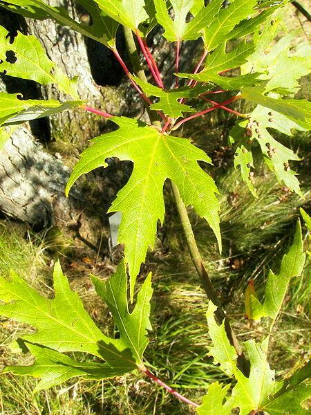</td></tr>
<tr><td><code>leaf_photo_attribution</code></td><td><a href="https://commons.wikimedia.org/wiki/File:Acer_saccharinum_002.jpg">Willow</a>, <a href="https://creativecommons.org/licenses/by-sa/3.0">CC BY-SA 3.0</a>, via Wikimedia Commons</td></tr>
<tr><td><code>flower_photo</code></td><td></td></tr>
<tr><td><code>flower_photo_attribution</code></td><td><a href="https://commons.wikimedia.org/wiki/File:20140312Acer_saccharinum.jpg">AnRo0002</a>, CC0, via Wikimedia Commons</td></tr>
<tr><td><code>fruit_or_seed_photo</code></td><td></td></tr>
<tr><td><code>fruit_or_seed_photo_attribution</code></td><td><a href="https://commons.wikimedia.org/wiki/File:2019-04-23_13_49_25_Ripe_Silver_Maple_seeds_along_Tranquility_Lane_in_the_Franklin_Farm_section_of_Oak_Hill,_Fairfax_County,_Virginia.jpg">Famartin</a>, <a href="https://creativecommons.org/licenses/by-sa/4.0">CC BY-SA 4.0</a>, via Wikimedia Commons</td></tr></table>

<h2>Western Red Cedar</h2><table>
<tr><td><code>common_name</code></td><td>Western Red Cedar</td></tr>
<tr><td><code>scientific_name</code></td><td>Thuja plicata</td></tr>
<tr><td><code>native_region</code></td><td>Western N. America</td></tr>
<tr><td><code>full_photo</code></td><td></td></tr>
<tr><td><code>full_photo_attribution</code></td><td><a href="https://commons.wikimedia.org/wiki/File:Thuja_plicata_Vancouver.jpg">abdallahh from Montréal, Canada</a>, <a href="https://creativecommons.org/licenses/by/2.0">CC BY 2.0</a>, via Wikimedia Commons;&nbsp;<a href="https://commons.wikimedia.org/wiki/File:Thuja_plicata_(24959698947).jpg">Dan Keck from Ohio</a>, CC0, via Wikimedia Commons</td></tr>
<tr><td><code>leaf_photo</code></td><td></td></tr>
<tr><td><code>leaf_photo_attribution</code></td><td><a href="https://commons.wikimedia.org/wiki/File:Thuja_plicata_RF.jpg">Robert Flogaus-Faust</a>, <a href="https://creativecommons.org/licenses/by/4.0">CC BY 4.0</a>, via Wikimedia Commons</td></tr>
<tr><td><code>flower_photo</code></td><td></td></tr>
<tr><td><code>flower_photo_attribution</code></td><td><a href="https://commons.wikimedia.org/wiki/File:Thuja_plicata_kz1.JPG">Krzysztof Ziarnek, Kenraiz</a>, <a href="https://creativecommons.org/licenses/by-sa/4.0">CC BY-SA 4.0</a>, via Wikimedia Commons</td></tr>
<tr><td><code>fruit_or_seed_photo</code></td><td></td></tr>
<tr><td><code>fruit_or_seed_photo_attribution</code></td><td></td></tr></table>

<h2>Douglas Fir</h2><table>
<tr><td><code>common_name</code></td><td>Douglas Fir</td></tr>
<tr><td><code>scientific_name</code></td><td>Pseudotsuga menziesii</td></tr>
<tr><td><code>native_region</code></td><td>Western N. America</td></tr>
<tr><td><code>full_photo</code></td><td>
 
</td></tr>
<tr><td><code>full_photo_attribution</code></td><td><a href="https://commons.wikimedia.org/wiki/File:Pseudotsuga_menziesii_12zz.jpg">Photo by David J. Stang</a>, <a href="https://creativecommons.org/licenses/by-sa/4.0">CC BY-SA 4.0</a>, via Wikimedia Commons;&nbsp;<a href="https://commons.wikimedia.org/wiki/File:Pseudotsuga_menziesii_4zz.jpg">Photo by David J. Stang</a>, <a href="https://creativecommons.org/licenses/by-sa/4.0">CC BY-SA 4.0</a>, via Wikimedia Commons</td></tr>
<tr><td><code>leaf_photo</code></td><td>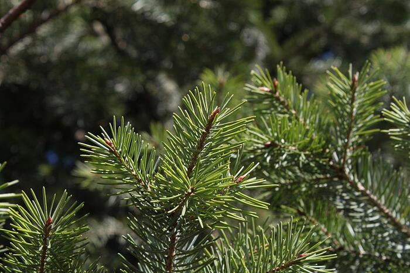</td></tr>
<tr><td><code>leaf_photo_attribution</code></td><td><a href="https://commons.wikimedia.org/wiki/File:Pseudotsuga_menziesii_branch_underside.JPG">Crusier</a>, <a href="https://creativecommons.org/licenses/by-sa/3.0">CC BY-SA 3.0</a>, via Wikimedia Commons</td></tr>
<tr><td><code>flower_photo</code></td><td></td></tr>
<tr><td><code>flower_photo_attribution</code></td><td><a href="https://commons.wikimedia.org/wiki/File:Pseudotsuga_menziesii_var._glauca_young_female_cone_-_Keila.jpg">Ivar Leidus</a>, <a href="https://creativecommons.org/licenses/by-sa/4.0">CC BY-SA 4.0</a>, via Wikimedia Commons</td></tr>
<tr><td><code>fruit_or_seed_photo</code></td><td></td></tr>
<tr><td><code>fruit_or_seed_photo_attribution</code></td><td><a href="https://commons.wikimedia.org/wiki/File:Douglas_fir_cone.jpg">Luis Apiolaza</a>, <a href="https://creativecommons.org/licenses/by-sa/4.0">CC BY-SA 4.0</a>, via Wikimedia Commons</td></tr></table>

<h2>Coastal Redwood</h2><table>
<tr><td><code>common_name</code></td><td>Coastal Redwood</td></tr>
<tr><td><code>scientific_name</code></td><td>Sequoia sempervirens</td></tr>
<tr><td><code>native_region</code></td><td>Western N. America</td></tr>
<tr><td><code>full_photo</code></td><td></td></tr>
<tr><td><code>full_photo_attribution</code></td><td><a href="https://commons.wikimedia.org/wiki/File:Sequoia_sempervirens_by_Line1.jpg">Liné1</a>, <a href="http://creativecommons.org/licenses/by-sa/3.0/">CC BY-SA 3.0</a>, via Wikimedia Commons;&nbsp;<a href="https://commons.wikimedia.org/wiki/File:Sequoiafarm_Sequoia_sempervirens.jpg">Sverrir Mirdsson</a>, <a href="https://creativecommons.org/licenses/by-sa/3.0">CC BY-SA 3.0</a>, via Wikimedia Commons</td></tr>
<tr><td><code>leaf_photo</code></td><td></td></tr>
<tr><td><code>leaf_photo_attribution</code></td><td><a href="https://commons.wikimedia.org/wiki/File:Sequoia_sempervirens_foliage.JPG">Crusier</a>, <a href="https://creativecommons.org/licenses/by-sa/3.0">CC BY-SA 3.0</a>, via Wikimedia Commons</td></tr>
<tr><td><code>flower_photo</code></td><td></td></tr>
<tr><td><code>flower_photo_attribution</code></td><td></td></tr>
<tr><td><code>fruit_or_seed_photo</code></td><td>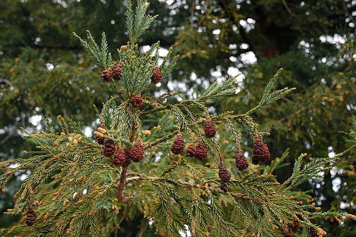</td></tr>
<tr><td><code>fruit_or_seed_photo_attribution</code></td><td><a href="https://commons.wikimedia.org/wiki/File:Sequoia_sempervirens_foliage_cones_Mount_Tamalpais_1.jpg">Ilya Katsnelson from Mountain View, USA</a>, <a href="https://creativecommons.org/licenses/by/2.0">CC BY 2.0</a>, via Wikimedia Commons</td></tr></table>

<h2>Giant Sequoia/Sierran Redwood</h2><table>
<tr><td><code>common_name</code></td><td>Giant Sequoia/Sierran Redwood</td></tr>
<tr><td><code>scientific_name</code></td><td>Sequoiadendron giganteum</td></tr>
<tr><td><code>native_region</code></td><td>Western N. America</td></tr>
<tr><td><code>full_photo</code></td><td></td></tr>
<tr><td><code>full_photo_attribution</code></td><td><a href="https://commons.wikimedia.org/wiki/File:Sequoiadendron_giganteum_01.jpg">A.Poulos (Iya) from USA</a>, <a href="https://creativecommons.org/licenses/by/2.0">CC BY 2.0</a>, via Wikimedia Commons;&nbsp;<a href="https://commons.wikimedia.org/wiki/File:Sequoiadendron_giganteum_0zz.jpg">Photo by David J. Stang</a>, <a href="https://creativecommons.org/licenses/by-sa/4.0">CC BY-SA 4.0</a>, via Wikimedia Commons</td></tr>
<tr><td><code>leaf_photo</code></td><td></td></tr>
<tr><td><code>leaf_photo_attribution</code></td><td><a href="https://commons.wikimedia.org/wiki/File:Sequoiadendron_giganteum_3zz.jpg">Photo by David J. Stang</a>, <a href="https://creativecommons.org/licenses/by-sa/4.0">CC BY-SA 4.0</a>, via Wikimedia Commons</td></tr>
<tr><td><code>flower_photo</code></td><td></td></tr>
<tr><td><code>flower_photo_attribution</code></td><td></td></tr>
<tr><td><code>fruit_or_seed_photo</code></td><td>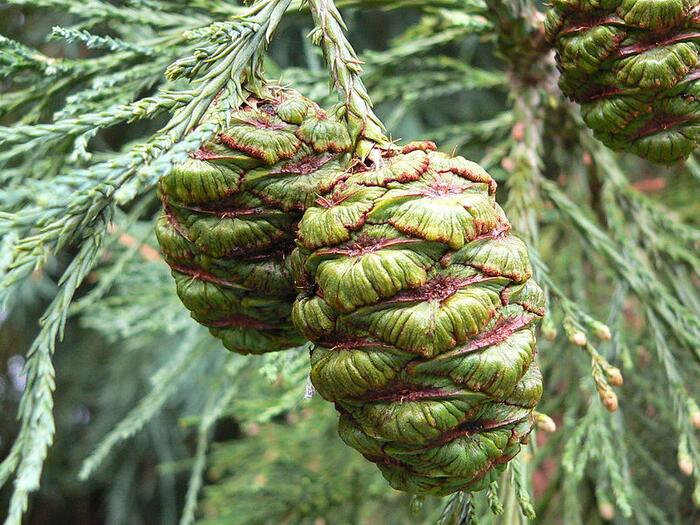</td></tr>
<tr><td><code>fruit_or_seed_photo_attribution</code></td><td><a href="https://commons.wikimedia.org/wiki/File:GreenSeedConesSequoiadendronGiganteum.JPG">Thereidshome</a>, Public domain, via Wikimedia Commons
</td></tr></table>

<h2>White ash</h2><table>
<tr><td><code>common_name</code></td><td>White ash</td></tr>
<tr><td><code>scientific_name</code></td><td>Fraxinus americana</td></tr>
<tr><td><code>native_region</code></td><td>Eastern N. America</td></tr>
<tr><td><code>full_photo</code></td><td></td></tr>
<tr><td><code>full_photo_attribution</code></td><td><a href="https://commons.wikimedia.org/wiki/File:Fraxinus_americana_002.jpg">Willow</a>, <a href="https://creativecommons.org/licenses/by-sa/3.0">CC BY-SA 3.0</a>, via Wikimedia Commons;&nbsp;<a href="https://commons.wikimedia.org/wiki/File:2015-10-21_10_03_14_White_Ash_sapling_during_autumn_along_North_Olden_Avenue_(Mercer_County_Route_622)_in_Ewing,_New_Jersey.jpg">Famartin</a>, <a href="https://creativecommons.org/licenses/by-sa/4.0">CC BY-SA 4.0</a>, via Wikimedia Commons</td></tr>
<tr><td><code>leaf_photo</code></td><td></td></tr>
<tr><td><code>leaf_photo_attribution</code></td><td><a href="https://commons.wikimedia.org/wiki/File:Fraxinus_americana_-_University_of_Kentucky_Arboretum_-_DSC09335.JPG">Daderot</a>, CC0, via Wikimedia Commons</td></tr>
<tr><td><code>flower_photo</code></td><td></td></tr>
<tr><td><code>flower_photo_attribution</code></td><td><a href="https://commons.wikimedia.org/wiki/File:2020-04-19_11_28_19_Flowers_developing_on_a_White_Ash_tree_along_Dunmore_Avenue_in_the_Parkway_Village_section_of_Ewing_Township,_Mercer_County,_New_Jersey.jpg">Famartin</a>, <a href="https://creativecommons.org/licenses/by-sa/4.0">CC BY-SA 4.0</a>, via Wikimedia Commons</td></tr>
<tr><td><code>fruit_or_seed_photo</code></td><td></td></tr>
<tr><td><code>fruit_or_seed_photo_attribution</code></td><td><a href="https://commons.wikimedia.org/wiki/File:Fraxinus_americana_seeds.jpg">Keith Kanoti, Maine Forest Service, USA</a>, <a href="https://creativecommons.org/licenses/by/3.0/us/deed.en">CC BY 3.0 US</a>, via Wikimedia Commons</td></tr></table>

<h2>Black Locust</h2><table>
<tr><td><code>common_name</code></td><td>Black Locust</td></tr>
<tr><td><code>scientific_name</code></td><td>Robinia pseudoacacia</td></tr>
<tr><td><code>native_region</code></td><td>Eastern N. America</td></tr>
<tr><td><code>full_photo</code></td><td></td></tr>
<tr><td><code>full_photo_attribution</code></td><td><a href="https://commons.wikimedia.org/wiki/File:Robinia_pseudoacacia_-_Robinie_-_Mörfelden-Walldorf_-_Germany_-_02.jpg">Norbert Nagel</a>, <a href="https://creativecommons.org/licenses/by-sa/3.0">CC BY-SA 3.0</a>, via Wikimedia Commons</td></tr>
<tr><td><code>leaf_photo</code></td><td></td></tr>
<tr><td><code>leaf_photo_attribution</code></td><td><a href="https://commons.wikimedia.org/wiki/File:Robinia_pseudoacacia_3.jpg">Thayne Tuason</a>, <a href="https://creativecommons.org/licenses/by-sa/4.0">CC BY-SA 4.0</a>, via Wikimedia Commons</td></tr>
<tr><td><code>flower_photo</code></td><td></td></tr>
<tr><td><code>flower_photo_attribution</code></td><td><a href="https://commons.wikimedia.org/wiki/File:Flowers_of_Robinia_pseudoacacia.jpg">Andrew Butko</a>, <a href="https://creativecommons.org/licenses/by-sa/3.0">CC BY-SA 3.0</a>, via Wikimedia Commons</td></tr>
<tr><td><code>fruit_or_seed_photo</code></td><td></td></tr>
<tr><td><code>fruit_or_seed_photo_attribution</code></td><td><a href="https://commons.wikimedia.org/wiki/File:20150225Robinia_pseudoacacia.jpg">AnRo0002</a>, CC0, via Wikimedia Commons</td></tr></table>

<h2>American Paw Paw</h2><table>
<tr><td><code>common_name</code></td><td>American Paw Paw</td></tr>
<tr><td><code>scientific_name</code></td><td>Asimina triloba</td></tr>
<tr><td><code>native_region</code></td><td>Eastern N. America</td></tr>
<tr><td><code>full_photo</code></td><td></td></tr>
<tr><td><code>full_photo_attribution</code></td><td><a href="https://commons.wikimedia.org/wiki/File:Asimina_triloba_(Paw_Paw)_(24374695518).jpg">Plant Image Library from Boston, USA</a>, <a href="https://creativecommons.org/licenses/by-sa/2.0">CC BY-SA 2.0</a>, via Wikimedia Commons;&nbsp;<a href="https://commons.wikimedia.org/wiki/File:Asimina_triloba_Asymina_trójklapowa_2014-10-12_01.jpg">Agnieszka Kwiecień, Nova</a>, <a href="https://creativecommons.org/licenses/by-sa/4.0">CC BY-SA 4.0</a>, via Wikimedia Commons</td></tr>
<tr><td><code>leaf_photo</code></td><td></td></tr>
<tr><td><code>leaf_photo_attribution</code></td><td><a href="https://commons.wikimedia.org/wiki/File:Pawpaw_(30381530933).jpg">Katja Schulz from Washington, D. C., USA</a>, <a href="https://creativecommons.org/licenses/by/2.0">CC BY 2.0</a>, via Wikimedia Commons</td></tr>
<tr><td><code>flower_photo</code></td><td>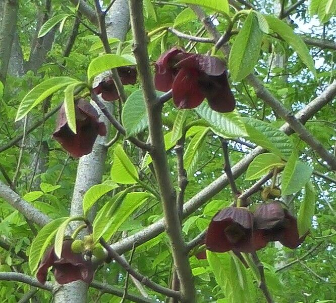</td></tr>
<tr><td><code>flower_photo_attribution</code></td><td><a href="https://commons.wikimedia.org/wiki/File:Paw_Paw_blossom.jpg">Geoffrey.landis</a>, <a href="https://creativecommons.org/licenses/by-sa/4.0">CC BY-SA 4.0</a>, via Wikimedia Commons</td></tr>
<tr><td><code>fruit_or_seed_photo</code></td><td></td></tr>
<tr><td><code>fruit_or_seed_photo_attribution</code></td><td><a href="https://commons.wikimedia.org/wiki/File:Asimina_triloba_Asymina_trójklapowa_2020-07-18_01.jpg">Agnieszka Kwiecień, Nova</a>, <a href="https://creativecommons.org/licenses/by-sa/4.0">CC BY-SA 4.0</a>, via Wikimedia Commons</td></tr></table>

<h2>Flowering Dogwood</h2><table>
<tr><td><code>common_name</code></td><td>Flowering Dogwood</td></tr>
<tr><td><code>scientific_name</code></td><td>Cornus florida</td></tr>
<tr><td><code>native_region</code></td><td>Eastern N. America</td></tr>
<tr><td><code>full_photo</code></td><td></td></tr>
<tr><td><code>full_photo_attribution</code></td><td><a href="https://commons.wikimedia.org/wiki/File:2013-05-04_13_55_34_Cornus_florida_(Flowering_Dogwood)_at_988_Terrace_Boulevard_in_Ewing,_New_Jersey.JPG">Famartin</a>, <a href="https://creativecommons.org/licenses/by-sa/3.0">CC BY-SA 3.0</a>, via Wikimedia Commons</td></tr>
<tr><td><code>leaf_photo</code></td><td></td></tr>
<tr><td><code>leaf_photo_attribution</code></td><td><a href="https://commons.wikimedia.org/wiki/File:Cornus_florida_(Flowering_Dogwood)_(34796659160).jpg">Plant Image Library from Boston, USA</a>, <a href="https://creativecommons.org/licenses/by-sa/2.0">CC BY-SA 2.0</a>, via Wikimedia Commons</td></tr>
<tr><td><code>flower_photo</code></td><td></td></tr>
<tr><td><code>flower_photo_attribution</code></td><td><a href="https://commons.wikimedia.org/wiki/File:Cornus_florida_Arkansas.jpg">Eric Hunt</a>, <a href="https://creativecommons.org/licenses/by-sa/4.0">CC BY-SA 4.0</a>, via Wikimedia Commons</td></tr>
<tr><td><code>fruit_or_seed_photo</code></td><td></td></tr>
<tr><td><code>fruit_or_seed_photo_attribution</code></td><td><a href="https://commons.wikimedia.org/wiki/File:2019-11-06_12_35_15_Flowering_Dogwood_leaves_and_fruit_in_late_autumn_along_Tayloe_Court_in_the_Franklin_Farm_section_of_Oak_Hill,_Fairfax_County,_Virginia.jpg">Famartin</a>, <a href="https://creativecommons.org/licenses/by-sa/4.0">CC BY-SA 4.0</a>, via Wikimedia Commons</td></tr></table>

<h2>Loblolly Pine</h2><table>
<tr><td><code>common_name</code></td><td>Loblolly Pine</td></tr>
<tr><td><code>scientific_name</code></td><td>Pinus taeda</td></tr>
<tr><td><code>native_region</code></td><td>Eastern N. America</td></tr>
<tr><td><code>full_photo</code></td><td></td></tr>
<tr><td><code>full_photo_attribution</code></td><td><a href="https://commons.wikimedia.org/wiki/File:Loblolly_Pines_South_Mississippi.JPG">Woodlot</a>, <a href="https://creativecommons.org/licenses/by-sa/3.0">CC BY-SA 3.0</a>, via Wikimedia Commons;&nbsp;<a href="https://commons.wikimedia.org/wiki/File:Pinus_taeda_1zz.jpg">Photo by David J. Stang</a>, <a href="https://creativecommons.org/licenses/by-sa/4.0">CC BY-SA 4.0</a>, via Wikimedia Commons</td></tr>
<tr><td><code>leaf_photo</code></td><td></td></tr>
<tr><td><code>leaf_photo_attribution</code></td><td><a href="https://commons.wikimedia.org/wiki/File:Pinus_taeda_14zz.jpg">Photo by David J. Stang</a>, <a href="https://creativecommons.org/licenses/by-sa/4.0">CC BY-SA 4.0</a>, via Wikimedia Commons</td></tr>
<tr><td><code>flower_photo</code></td><td></td></tr>
<tr><td><code>flower_photo_attribution</code></td><td><a href="https://commons.wikimedia.org/wiki/File:2019-04-21_18_24_25_Loblolly_Pine_pollen_cones_along_Lees_Corner_Road_in_the_Armfield_Farm_section_of_Chantilly,_Fairfax_County,_Virginia.jpg">Famartin</a>, <a href="https://creativecommons.org/licenses/by-sa/4.0">CC BY-SA 4.0</a>, via Wikimedia Commons</td></tr>
<tr><td><code>fruit_or_seed_photo</code></td><td></td></tr>
<tr><td><code>fruit_or_seed_photo_attribution</code></td><td><a href="https://commons.wikimedia.org/wiki/File:Pinus_taeda_cone_Blackwater_NWR_MD.jpg">Alicia Pimental from Queenstown, Maryland, United States</a>, <a href="https://creativecommons.org/licenses/by/2.0">CC BY 2.0</a>, via Wikimedia Commons</td></tr></table>

<h2>Osage orange/Hedge apple</h2><table>
<tr><td><code>common_name</code></td><td>Osage orange/Hedge apple</td></tr>
<tr><td><code>scientific_name</code></td><td>Maclura pomifera</td></tr>
<tr><td><code>native_region</code></td><td>Eastern N. America</td></tr>
<tr><td><code>full_photo</code></td><td></td></tr>
<tr><td><code>full_photo_attribution</code></td><td><a href="https://commons.wikimedia.org/wiki/File:Lasdon_Arboretum_-_Maclura_pomifera_-_IMG_1420.jpg">Daderot</a>, Public domain, via Wikimedia Commons,&nbsp;<a href="https://commons.wikimedia.org/wiki/File:Westover_Park_(31060342845).jpg">dankeck</a>, CC0, via Wikimedia Commons</td></tr>
<tr><td><code>leaf_photo</code></td><td></td></tr>
<tr><td><code>leaf_photo_attribution</code></td><td><a href="https://commons.wikimedia.org/wiki/File:Maclura_pomifera,_loof,_Manie_van_der_Schijff_BT,_a.jpg">JMK</a>, <a href="https://creativecommons.org/licenses/by-sa/4.0">CC BY-SA 4.0</a>, via Wikimedia Commons</td></tr>
<tr><td><code>flower_photo</code></td><td></td></tr>
<tr><td><code>flower_photo_attribution</code></td><td><a href="https://commons.wikimedia.org/wiki/File:Maclura_pomifera_003.JPG">H. Zell</a>, <a href="https://creativecommons.org/licenses/by-sa/3.0">CC BY-SA 3.0</a>, via Wikimedia Commons</td></tr>
<tr><td><code>fruit_or_seed_photo</code></td><td></td></tr>
<tr><td><code>fruit_or_seed_photo_attribution</code></td><td><a href="https://commons.wikimedia.org/wiki/File:Maclura_pomifera.JPG">Mahieddine23</a>, <a href="https://creativecommons.org/licenses/by-sa/3.0">CC BY-SA 3.0</a>, via Wikimedia Commons</td></tr></table>

<h2>Burr oak</h2><table>
<tr><td><code>common_name</code></td><td>Burr oak</td></tr>
<tr><td><code>scientific_name</code></td><td>Quercus macrocarpa</td></tr>
<tr><td><code>native_region</code></td><td>Eastern N. America</td></tr>
<tr><td><code>full_photo</code></td><td></td></tr>
<tr><td><code>full_photo_attribution</code></td><td><a href="https://commons.wikimedia.org/wiki/File:Quercus_macrocarpa_(23797146829).jpg">Bruce Kirchoff from Greensboro, NC, USA</a>, <a href="https://creativecommons.org/licenses/by/2.0">CC BY 2.0</a>, via Wikimedia Commons,&nbsp;<a href="https://commons.wikimedia.org/wiki/File:Great_Burr_Oak_on_a_Dramatic_Morning.jpg">Heath Cajandig</a>, <a href="https://creativecommons.org/licenses/by/2.0">CC BY 2.0</a>, via Wikimedia Commons</td></tr>
<tr><td><code>leaf_photo</code></td><td></td></tr>
<tr><td><code>leaf_photo_attribution</code></td><td><a href="https://commons.wikimedia.org/wiki/File:Quercus_macrocarpa_hojas_JBCLM.jpg">JBCLM</a>, <a href="https://creativecommons.org/licenses/by-sa/4.0">CC BY-SA 4.0</a>, via Wikimedia Commons</td></tr>
<tr><td><code>flower_photo</code></td><td></td></tr>
<tr><td><code>flower_photo_attribution</code></td><td><a href="https://commons.wikimedia.org/wiki/File:Quercus_macrocarpa_(Bur_Oak)_(33645993643).jpg">Plant Image Library from Boston, USA</a>, <a href="https://creativecommons.org/licenses/by-sa/2.0">CC BY-SA 2.0</a>, via Wikimedia Commons</td></tr>
<tr><td><code>fruit_or_seed_photo</code></td><td></td></tr>
<tr><td><code>fruit_or_seed_photo_attribution</code></td><td><a href="https://commons.wikimedia.org/wiki/File:Quercus_macrocarpa_(5108085936).jpg">Matt Lavin from Bozeman, Montana, USA</a>, <a href="https://creativecommons.org/licenses/by-sa/2.0">CC BY-SA 2.0</a>, via Wikimedia Commons</td></tr></table>

<h2>White oak</h2><table>
<tr><td><code>common_name</code></td><td>White oak</td></tr>
<tr><td><code>scientific_name</code></td><td>Quercus alba</td></tr>
<tr><td><code>native_region</code></td><td>Eastern N. America</td></tr>
<tr><td><code>full_photo</code></td><td></td></tr>
<tr><td><code>full_photo_attribution</code></td><td><a href="https://commons.wikimedia.org/wiki/File:2019-04-27_15_08_12_White_Oak_leafing_out_in_mid-Spring_along_Franklin_Farm_Road_in_the_Franklin_Farm_section_of_Oak_Hill,_Fairfax_County,_Virginia.jpg">Famartin</a>, <a href="https://creativecommons.org/licenses/by-sa/4.0">CC BY-SA 4.0</a>, via Wikimedia Commons,&nbsp;<a href="https://commons.wikimedia.org/wiki/File:2020-11-07_16_45_00_View_up_into_the_canopy_of_a_White_Oak_in_autumn_along_a_walking_trail_in_the_Franklin_Glen_section_of_Chantilly,_Fairfax_County,_Virginia.jpg">Famartin</a>, <a href="https://creativecommons.org/licenses/by-sa/4.0">CC BY-SA 4.0</a>, via Wikimedia Commons</td></tr>
<tr><td><code>leaf_photo</code></td><td></td></tr>
<tr><td><code>leaf_photo_attribution</code></td><td><a href="https://commons.wikimedia.org/wiki/File:Quercus_alba_kz01.jpg">Krzysztof Ziarnek, Kenraiz</a>, <a href="https://creativecommons.org/licenses/by-sa/4.0">CC BY-SA 4.0</a>, via Wikimedia Commons</td></tr>
<tr><td><code>flower_photo</code></td><td></td></tr>
<tr><td><code>flower_photo_attribution</code></td><td><a href="https://commons.wikimedia.org/wiki/File:2021-04-22_18_54_32_Male_flowers_(catkins)_on_a_White_Oak_within_a_wooded_area_in_the_Franklin_Farm_section_of_Oak_Hill,_Fairfax_County,_Virginia.jpg">Famartin</a>, <a href="https://creativecommons.org/licenses/by-sa/4.0">CC BY-SA 4.0</a>, via Wikimedia Commons</td></tr>
<tr><td><code>fruit_or_seed_photo</code></td><td></td></tr>
<tr><td><code>fruit_or_seed_photo_attribution</code></td><td><a href="https://commons.wikimedia.org/wiki/File:Quercus_alba_2-acorn_branch.jpg">Dcrjsr</a>, <a href="https://creativecommons.org/licenses/by/4.0">CC BY 4.0</a>, via Wikimedia Commons</td></tr></table>

<h2>American Elm</h2><table>
<tr><td><code>common_name</code></td><td>American Elm</td></tr>
<tr><td><code>scientific_name</code></td><td>Ulmus americana</td></tr>
<tr><td><code>native_region</code></td><td>Eastern N. America</td></tr>
<tr><td><code>full_photo</code></td><td></td></tr>
<tr><td><code>full_photo_attribution</code></td><td><a href="https://commons.wikimedia.org/wiki/File:Hatfield_Elm_Tree,_Hatfield,_MA_-_May_2020.jpg">Msact</a>, <a href="https://creativecommons.org/licenses/by-sa/4.0">CC BY-SA 4.0</a>, via Wikimedia Commons,&nbsp;<a href="https://commons.wikimedia.org/wiki/File:Old_American_elm_tree_near_Horticultural_Hall_in_Halifax_Public_Gardens_-_August_2019.jpg">Msact</a>, <a href="https://creativecommons.org/licenses/by-sa/4.0">CC BY-SA 4.0</a>, via Wikimedia Commons</td></tr>
<tr><td><code>leaf_photo</code></td><td></td></tr>
<tr><td><code>leaf_photo_attribution</code></td><td><a href="https://commons.wikimedia.org/wiki/File:Ulmus_americana_(5101983801).jpg">Matt Lavin from Bozeman, Montana, USA</a>, <a href="https://creativecommons.org/licenses/by-sa/2.0">CC BY-SA 2.0</a>, via Wikimedia Commons</td></tr>
<tr><td><code>flower_photo</code></td><td></td></tr>
<tr><td><code>flower_photo_attribution</code></td><td><a href="http://libraryexhibits.uvm.edu/omeka/items/show/1189">Jim Conrad, “American elm - flower,”</a>&nbsp;via libraryexhibits.uvm.edu</td></tr>
<tr><td><code>fruit_or_seed_photo</code></td><td></td></tr>
<tr><td><code>fruit_or_seed_photo_attribution</code></td><td><a href="https://www.flickr.com/photos/dendroica/34150993885/in/photostream/">Dendroica cerulea</a>,&nbsp;<a href="https://creativecommons.org/licenses/by-nc-sa/2.0/">CC BY-NC-SA 2.0</a>, via Flickr</td></tr></table>

<h2>Honey locust</h2><table>
<tr><td><code>common_name</code></td><td>Honey locust</td></tr>
<tr><td><code>scientific_name</code></td><td>Gleditsia triacanthos</td></tr>
<tr><td><code>native_region</code></td><td>Eastern N. America</td></tr>
<tr><td><code>full_photo</code></td><td>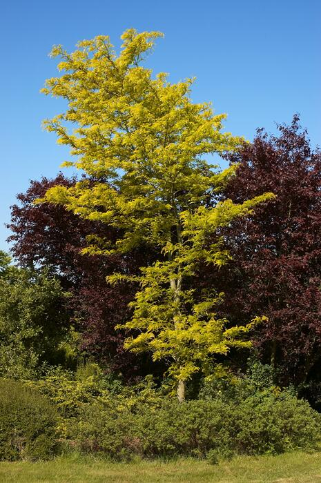</td></tr>
<tr><td><code>full_photo_attribution</code></td><td><a href="https://commons.wikimedia.org/wiki/File:Gleditsia_sunburst_A.jpg">Wouter Hagens</a>, Public domain, via Wikimedia Commons,&nbsp;<a href="https://commons.wikimedia.org/wiki/File:Gleditsia_triacanthos_at_the_El_Paso_Museum_of_Archaelogy.jpg">Susan Barnum</a>, <a href="https://creativecommons.org/licenses/by-sa/4.0">CC BY-SA 4.0</a>, via Wikimedia Commons</td></tr>
<tr><td><code>leaf_photo</code></td><td></td></tr>
<tr><td><code>leaf_photo_attribution</code></td><td><a href="https://commons.wikimedia.org/wiki/File:Gleditsia_triacanthos_foliage.jpg">Bostonian13</a>, <a href="https://creativecommons.org/licenses/by-sa/3.0">CC BY-SA 3.0</a>, via Wikimedia Commons</td></tr>
<tr><td><code>flower_photo</code></td><td></td></tr>
<tr><td><code>flower_photo_attribution</code></td><td><a href="https://commons.wikimedia.org/wiki/File:Gleditsia_triacanthos_in_Donetsk_2.jpg">Andrew Butko</a>, <a href="https://creativecommons.org/licenses/by-sa/3.0">CC BY-SA 3.0</a>, via Wikimedia Commons</td></tr>
<tr><td><code>fruit_or_seed_photo</code></td><td></td></tr>
<tr><td><code>fruit_or_seed_photo_attribution</code></td><td><a href="https://commons.wikimedia.org/wiki/File:Baden-Baden-Gleditsia_triacanthos-70-Lederhuelsenbaum-Frucht-2012-gje.jpg">Gerd Eichmann</a>, <a href="https://creativecommons.org/licenses/by-sa/4.0">CC BY-SA 4.0</a>, via Wikimedia Commons</td></tr></table>

<h2>Northern Catalpa</h2><table>
<tr><td><code>common_name</code></td><td>Northern Catalpa</td></tr>
<tr><td><code>scientific_name</code></td><td>Catalpa speciosa</td></tr>
<tr><td><code>native_region</code></td><td>Eastern N. America</td></tr>
<tr><td><code>full_photo</code></td><td>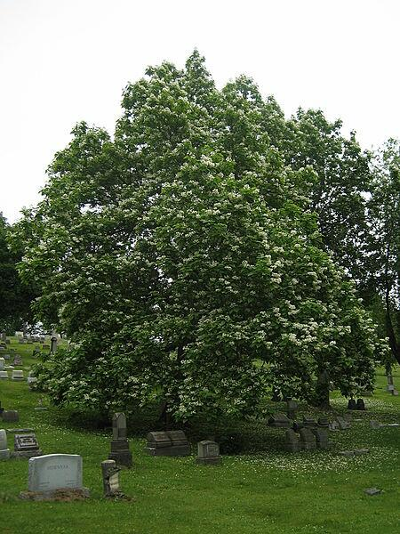</td></tr>
<tr><td><code>full_photo_attribution</code></td><td><a href="https://commons.wikimedia.org/wiki/File:Catalpa_speciosa_20060624.jpg">Mark Wagner</a>, <a href="https://creativecommons.org/licenses/by/2.5">CC BY 2.5</a>, via Wikimedia Commons,&nbsp;<a href="https://commons.wikimedia.org/wiki/File:Catalpa_speciosa,_2015-06-02,_Homewood_Cemetery,_04.jpg">Cbaile19</a>, CC0, via Wikimedia Commons</td></tr>
<tr><td><code>leaf_photo</code></td><td></td></tr>
<tr><td><code>leaf_photo_attribution</code></td><td><a href="https://commons.wikimedia.org/wiki/File:Catalpa_speciosa_10zz.jpg">Photo by David J. Stang</a>, <a href="https://creativecommons.org/licenses/by-sa/4.0">CC BY-SA 4.0</a>, via Wikimedia Commons</td></tr>
<tr><td><code>flower_photo</code></td><td></td></tr>
<tr><td><code>flower_photo_attribution</code></td><td><a href="https://commons.wikimedia.org/wiki/File:Catalpa_speciosa.JPG">Qwert1234</a>, <a href="http://creativecommons.org/licenses/sa/1.0/">CC SA 1.0</a>, via Wikimedia Commons</td></tr>
<tr><td><code>fruit_or_seed_photo</code></td><td></td></tr>
<tr><td><code>fruit_or_seed_photo_attribution</code></td><td><a href="https://commons.wikimedia.org/wiki/File:Catalpa_speciosa_7zz.jpg">Photo by David J. Stang</a>, <a href="https://creativecommons.org/licenses/by-sa/4.0">CC BY-SA 4.0</a>, via Wikimedia Commons</td></tr></table>

<h2>Ponderosa pine</h2><table>
<tr><td><code>common_name</code></td><td>Ponderosa pine</td></tr>
<tr><td><code>scientific_name</code></td><td>Pinus ponderosa</td></tr>
<tr><td><code>native_region</code></td><td>Western N. America</td></tr>
<tr><td><code>full_photo</code></td><td></td></tr>
<tr><td><code>full_photo_attribution</code></td><td><a href="https://commons.wikimedia.org/wiki/File:Pinus_ponderosa_15932.JPG">Walter Siegmund</a>, <a href="http://creativecommons.org/licenses/by-sa/3.0/">CC BY-SA 3.0</a>, via Wikimedia Commons,&nbsp;<a href="https://commons.wikimedia.org/wiki/File:Pinus_ponderosa_7979.JPG">Walter Siegmund</a>, <a href="https://creativecommons.org/licenses/by-sa/3.0">CC BY-SA 3.0</a>, via Wikimedia Commons</td></tr>
<tr><td><code>leaf_photo</code></td><td></td></tr>
<tr><td><code>leaf_photo_attribution</code></td><td><a href="https://commons.wikimedia.org/wiki/File:Pinus_ponderosa_brachyptera_foliage_cones_Arizona.jpg">Alan Levine from Strawberry, United States</a>, <a href="https://creativecommons.org/licenses/by/2.0">CC BY 2.0</a>, via Wikimedia Commons</td></tr>
<tr><td><code>flower_photo</code></td><td></td></tr>
<tr><td><code>flower_photo_attribution</code></td><td><a href="https://commons.wikimedia.org/wiki/File:Pinus_ponderosa_4755.JPG">Walter Siegmund</a>, <a href="https://creativecommons.org/licenses/by-sa/3.0">CC BY-SA 3.0</a>, via Wikimedia Commons</td></tr>
<tr><td><code>fruit_or_seed_photo</code></td><td></td></tr>
<tr><td><code>fruit_or_seed_photo_attribution</code></td><td><a href="https://commons.wikimedia.org/wiki/File:Pinus_ponderosa_var._scopulorum_(7458435882).jpg">Matt Lavin from Bozeman, Montana, USA</a>, <a href="https://creativecommons.org/licenses/by-sa/2.0">CC BY-SA 2.0</a>, via Wikimedia Commons</td></tr></table>

<h2>American Sycamore</h2><table>
<tr><td><code>common_name</code></td><td>American Sycamore</td></tr>
<tr><td><code>scientific_name</code></td><td>Platanus occidentalis</td></tr>
<tr><td><code>native_region</code></td><td>Eastern N. America</td></tr>
<tr><td><code>full_photo</code></td><td></td></tr>
<tr><td><code>full_photo_attribution</code></td><td><a href="https://commons.wikimedia.org/wiki/File:Moon_Tree_in_Keystone_Heights_Florida.jpg">Whoisjohngalt</a>, <a href="https://creativecommons.org/licenses/by-sa/4.0">CC BY-SA 4.0</a>, via Wikimedia Commons, <a href="https://commons.wikimedia.org/wiki/File:Platanus_occidentalis_Bloomington.jpg">Jeff Hart from Bloomington, IN, USA</a>, <a href="https://creativecommons.org/licenses/by/2.0">CC BY 2.0</a>, via Wikimedia Commons</td></tr>
<tr><td><code>leaf_photo</code></td><td></td></tr>
<tr><td><code>leaf_photo_attribution</code></td><td><a href="https://commons.wikimedia.org/wiki/File:A8-2-Platanus_occidentalis_(Eastern_Sycamore).JPG">MOHAMMED HAMZA</a>, <a href="https://creativecommons.org/licenses/by-sa/3.0">CC BY-SA 3.0</a>, via Wikimedia Commons</td></tr>
<tr><td><code>flower_photo</code></td><td></td></tr>
<tr><td><code>flower_photo_attribution</code></td><td><a href="https://www.flickr.com/photos/135541615@N05/34241887576">Na. J. Pilla</a>, <a href="https://creativecommons.org/licenses/by-sa/2.0">CC BY-SA 2.0</a>, via Flickr</td></tr>
<tr><td><code>fruit_or_seed_photo</code></td><td></td></tr>
<tr><td><code>fruit_or_seed_photo_attribution</code></td><td><a href="https://commons.wikimedia.org/wiki/File:Platanus_occidentalis-Platane_3462.jpg">Colsu</a>, <a href="https://creativecommons.org/licenses/by-sa/4.0">CC BY-SA 4.0</a>, via Wikimedia Commons</td></tr></table>

